<div align="center">

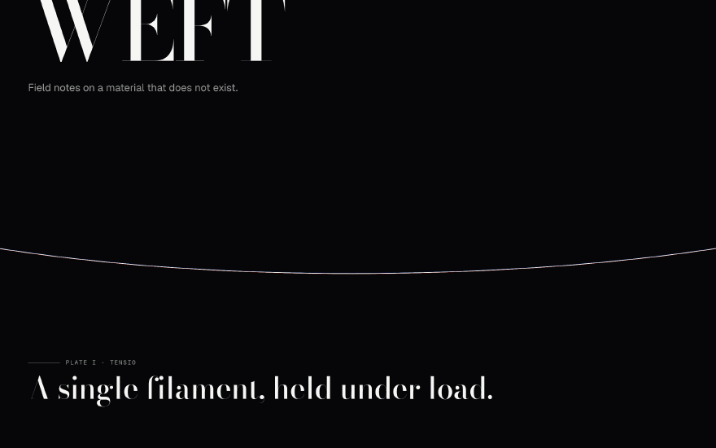

</div>

# WEFT

**Field notes on a material that does not exist.**

A scroll-driven specimen catalogue documenting the properties of an invented filament —
something that behaves partly like fibre and partly like light. One thread unspools from the
first pixel to the last and never breaks. Each plate subjects that same thread to a different
condition and records what happens.

Every frame is computed live in WebGL. There is no video anywhere in this site.

**[Source](https://github.com/christireid/weft)** · Live link pending deployment

<div align="center">

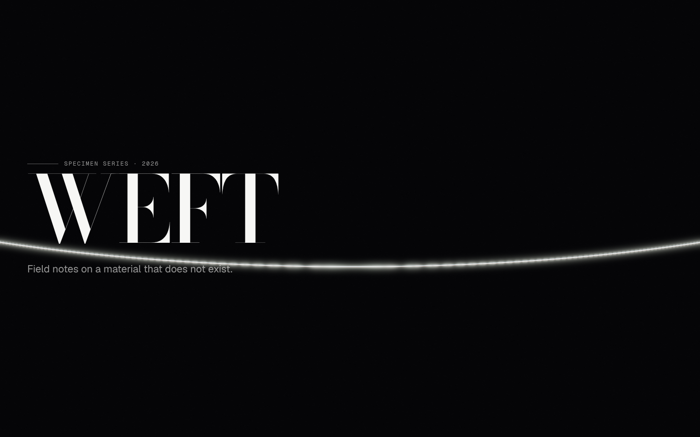

</div>

---

> ### Build status, stated plainly
>
> This is an in-progress build of a six-plate specification. **Two plates are built: I ·
> TENSIO and II · DISPERSIO.** Plates III–VI are specified and not yet implemented, and this
> README documents only what exists and runs.
>
> Every number below is measured on the machine described in [Performance](#performance).
> Nothing is estimated, and figures that could only come from hardware this build has not run
> on are left in `[BRACKETS]` rather than guessed.

---

## The plates

### Plate I · TENSIO

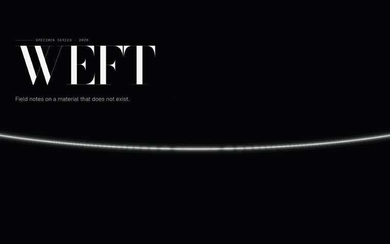

A single filament held under load, hanging in a shallow catenary. One white source. Grab it
and it answers.

> `1-D wave equation, u_tt = c²u_xx − 2γu_t, solved on a 512×1 ping-pong target at Courant 0.94`

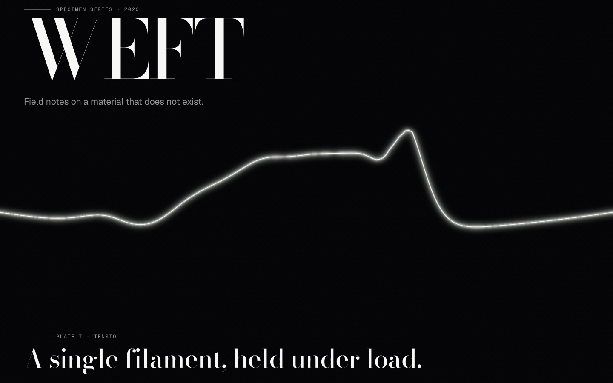

<table>
<tr>
<td width="50%">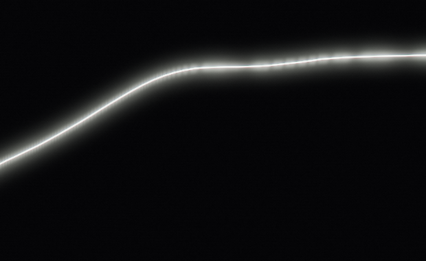</td>
<td width="50%">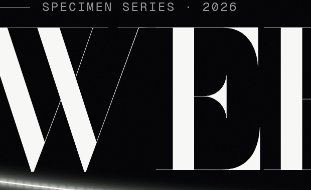</td>
</tr>
<tr>
<td><em>1:1. The core is two pixels; the wings are the spectral profile, and the halo is the bloom.</em></td>
<td><em>1:1. §2 asks that the thread cross the type. It does.</em></td>
</tr>
</table>

The wave is **simulated, not tweened**, and that distinction is the plate. §5.5 of the spec
forbids easing anything with mass, and everything the brief asks for falls out of the
equation rather than being authored: a disturbance splits into two counter-propagating pulses
because that is what the wave equation does with an initial displacement; both travel at the
same speed however hard you pull; they reflect and _invert_ at the pinned ends; amplitude
decays exponentially.

The Courant number is 0.94 rather than 1.0 for a specific reason. The scheme is exact at
C = 1 and lower values introduce numerical dispersion — a pulse that spreads as it travels
instead of holding its shape, which reads as rubber rather than fibre. It runs as close to
critical as is safe, with headroom for a long frame.

### Plate II · DISPERSIO


The filament, now travelling at speed, passes through a glass wedge. White light separates.
This plate establishes the rule that governs the whole piece: **all colour in WEFT is produced
by refraction. There is no brand accent.**

> `16 wavelengths, δ(λ) = (n(λ) − 1)·A, Cauchy n(λ) = A + B/λ², accumulated in CIE XYZ`


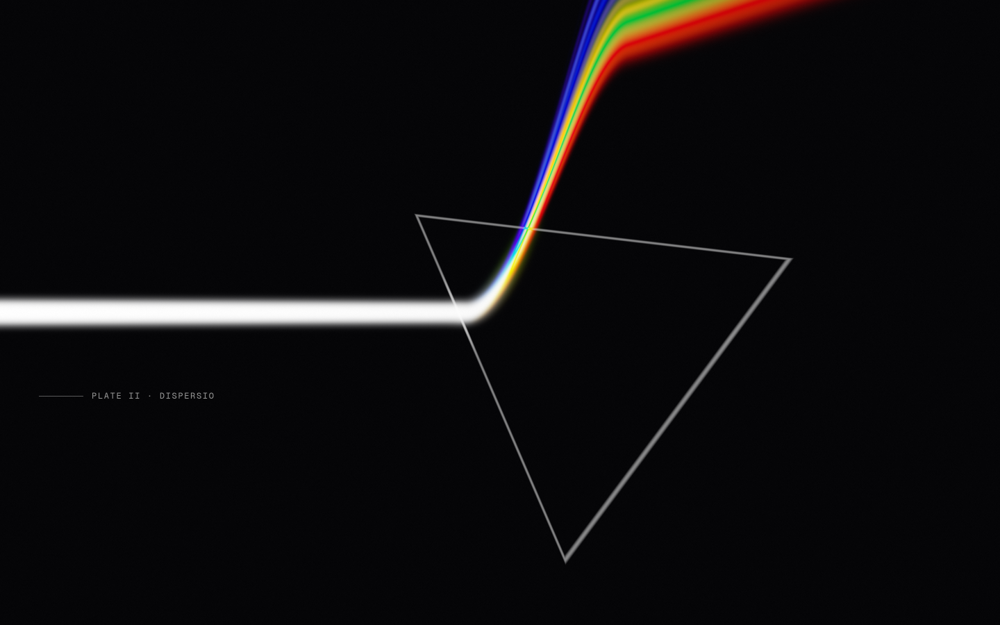

<em>The same wedge, rotated. The fan is a function of the glass, not of the gesture.</em>

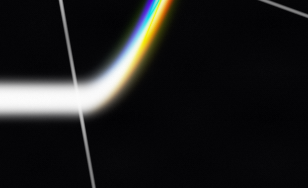

<em>1:1 at the exit face. Sixteen wavelengths, and no seam between any two of them — that
continuity is what the spectral accumulation buys and what a three-tap RGB split cannot fake.
The red end is compressed relative to the blue because n(λ) goes as 1/λ².</em>

The wedge is draggable — rotating it sweeps the spectrum across the viewport. There is no
slider, because there is no chrome on this page at all.

### Plate III · TURBULENTIA

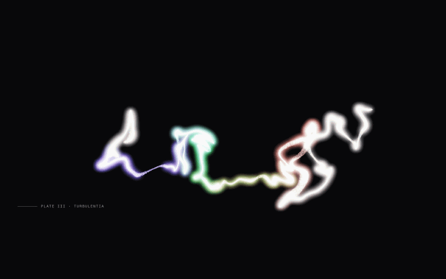

The filament frays. Its particles are carried through a curl-noise field, and each one keeps
the wavelength it had on the thread — so the cloud is a spectrum in suspension, violet at one
end and red at the other.

> `curl noise, v = ∇ × ψ(p), advected on a 512×512 float ping-pong pair, no CPU-side particle loop`


<table>
<tr>
<td width="50%">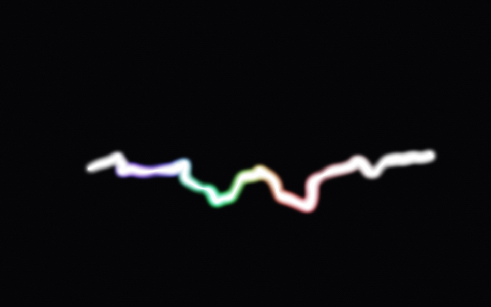</td>
<td width="50%">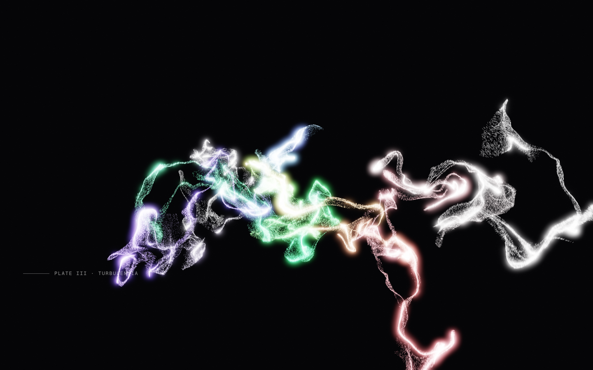</td>
</tr>
<tr>
<td><em>Early in the plate. The thread is still a thread.</em></td>
<td><em>The pointer, dragged through. §2 asks for a repulsor with a soft falloff; the curl closes
the wake behind it within about a second.</em></td>
</tr>
</table>

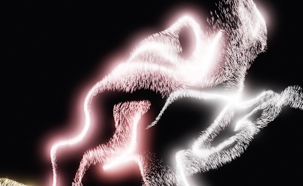

<em>1:1. Each particle is a point sprite with an oriented capsule drawn inside it, so a fast one
is a streak and a slow one is a dot. That is the one line of vertex shader §2 says produces most
of the visual interest, and at this scale you can count the hairs.</em>

Curl noise rather than plain noise, and the difference is the whole plate. The curl of any
vector field is divergence-free by construction — the divergence of a curl is identically
zero — so the flow conserves density exactly rather than approximately. Particles pushed
through a raw noise field bunch where it converges and thin where it diverges, and within a
few seconds the cloud has clumped. A divergence-free field keeps a fray a fray.

Each particle is a point sprite with an oriented capsule drawn inside it, so a fast particle
becomes a streak and a slow one stays a dot. That is one line in the vertex shader and it
produces most of what you can see.

The colour is ordered along the source thread rather than assigned at random, which is not a
detail. Random wavelengths give every pixel an independent saturated hue with no neighbourhood
to average against, and the cloud reads as RGB confetti — it looked like fine spectral speckle
at a third scale and only failed when a crop was opened at 1:1. Ordered, adjacent particles
carry adjacent wavelengths, so the fray separates into coloured strands.

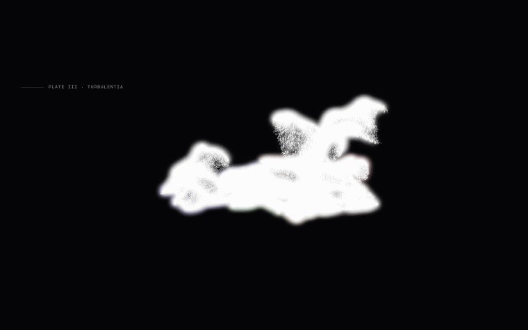


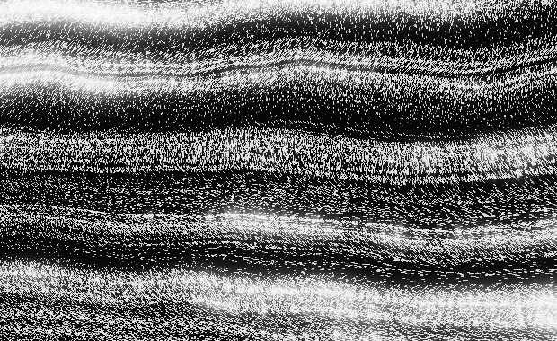

<em>1:1. Every particle on its own site, once.</em>

At the end of the plate the curl decays and a lattice attractor engages. Each particle has its
own site, indexed by its position in the simulation texture, so the cloud fills the grid
exactly once and resolves into rows and columns — the warp and weft the next plate is woven
from. Snapping to the nearest site instead piles particles onto wherever the cloud was already
dense and leaves the rest of the grid empty; that version resolved to a scatter of bright dots
and is kept in `docs/verification/captures/` as the counter-example.

The broad horizontal bands across that image are **moiré**, and they were not designed. A
512-row lattice sampled onto a 1800-pixel frame beats against the pixel grid, and the bloom
pass turns the beat into visible light. It happens to read as the sheen across woven fabric,
which is why it is still here — but it is an interference pattern that fell out of the
resolutions, not a decision, and calling it one would be the kind of retroactive intent this
document is trying to avoid.

---

## The colour is real

This is the part worth reading the source for.

A stock `ChromaticAberration` post-processing pass samples three points — R, G and B — and
offsets them. It produces three displaced copies of the image with visible gaps between them,
because three points are being asked to represent a continuum. WEFT samples **sixteen
wavelengths across 380–740 nm**, refracts each with its own index of refraction, and
accumulates through the CIE 1931 colour-matching functions. Adjacent wavelengths land adjacent
on screen, so the fan is continuous.

The colour-matching functions are **fitted in this repository**, not transcribed. The standard
analytic approximation is Wyman, Sloan & Shirley (JCGT 2013); that paper was unreachable from
the build sandbox, and inventing coefficients was not an option. So the _functional form_ is
taken from the literature and cited, and `tools/fit-cmf.mjs` fits the coefficients to
tabulated CIE 1931 2° data checked into the repo, seeded from the data's own peaks and
half-widths, using a hand-rolled Nelder-Mead.

Measured against the table, 361 samples at 1 nm, **on the GPU**:

| curve | RMSE        | max abs error |
| ----- | ----------- | ------------- |
| x̄     | 7.71 × 10⁻³ | 0.0202        |
| ȳ     | 3.03 × 10⁻³ | 0.0073        |
| z̄     | 4.53 × 10⁻³ | 0.0221        |

Two checks that this is the real curve and not merely a plausible one: **ȳ peaks at 0.9977 at
554 nm**, against the CIE definition of exactly 1.0 at 555 nm — and a flat spectrum resolves
to **exactly (1, 1, 1)** at 4, 8, 16, 32 and 64 samples. That second property is what lets a
slow device drop to 8 wavelengths and get a coarser spectrum rather than a tinted plate.

The XYZ → linear-sRGB matrix is derived from the IEC 61966-2-1 primaries and D65 by inverting
the matrix built from them. It comes out as the standard sRGB matrix to eight decimal places,
which is the check that the derivation is right, and maps D65 to (1.00000, 1.00000, 1.00000).

**The wedge glass is fictional and says so.** Its endpoint indices are 1.78 at 380 nm and 1.46
at 740 nm — roughly ten times the dispersion of a real flint glass. WEFT documents a material
that does not exist, so its wedge is not obliged to be N-BK7. What stays real is Cauchy's
_form_: the 1/λ² law, which compresses the red end of the fan and is what makes the separation
read as dispersion rather than as a gradient.

---

## How it works

There is exactly one `<canvas>`, one `requestAnimationFrame` loop, and one scroll subscription
in the entire application.

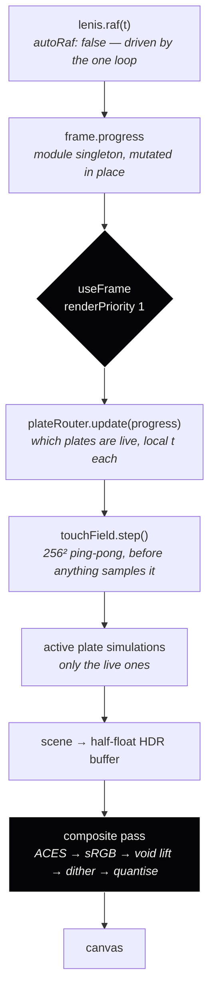

Three properties of that diagram are enforced by tests rather than by discipline:

- **One `useFrame`.** r3f runs priority-0 callbacks in registration order, which is mount
  order, which is not something to build a six-plate hand-off on. `tests/architecture.test.ts`
  fails the build if a second one appears — or a second `<Canvas>`, or a second Lenis, or a
  `gsap.ticker.add` (the recipe every Lenis+GSAP article gives, and a second rAF loop for the
  same reason).
- **Nothing in the loop allocates.** The same test greps the `useFrame` body for `new`, array
  literals, object literals and template strings — the four cheapest ways to start handing the
  GC 60 objects a second.
- **Scroll progress never passes through React state.** It is written to a module-scope mutable
  singleton and read inside the loop. Routing it through `useState` re-renders the tree at
  60 Hz and costs more than everything else on the page combined.

Full reasoning in [ADR-0001](docs/adr/0001-one-canvas-one-loop.md) and
[ADR-0002](docs/adr/0002-shared-touch-texture.md).

---

## The dither is load-bearing

The background is `#050507` and the plates are full of gradients in the darkest two percent of
the range. That is exactly where 8-bit output bands into visible contour rings. An 8×8 Bayer
matrix plus a stochastic term, applied _after_ the sRGB encode and immediately before
quantisation, converts those contours into structured texture — which happens to read as the
halftone of a printed plate.

Banding is visible as contour **edges**, so the measure is run length, not distinct-value
count. On a 0 → 0.02 linear ramp across 1024 samples:

|            | max run length | distinct levels |
| ---------- | -------------- | --------------- |
| undithered | **61 px**      | 27              |
| dithered   | **3 px**       | 35              |

A **20.3× reduction**. Three device pixels at DPR 2 is 1.5 CSS pixels — below the width at
which an edge is resolvable. The test also asserts that the _undithered_ control bands, because
a test whose control passes is measuring nothing.


<em>1:1, from a region of the frame that contains nothing at all. The peak level here is 11 of
255 and the mean is 7 — this is the void, and it is not flat. Downscale this image and the
pattern averages away into a colour, which is the whole reason the crop is here rather than a
full-frame still.</em>

One bug worth recording, because it was caught by looking rather than by reasoning: with the
scene buffer cleared to `--void`, the captured background came out `rgb(1.5, 1.5, 1.8)` instead
of `#050507`. ACES compresses the bottom of its range by roughly 4×, which is correct behaviour
for _light_ and wrong for a page colour. The scene now clears to black, everything the renderer
produces is treated as light, and the void is the floor light sits on.

---

## The tier ladder

§5.6 defines four device tiers, detected from a 500 ms boot probe and then adapted live from a
rolling p95 frame-time sampler. These three are the same scroll offset on the same machine,
separated only by `?tier=`, which exists so the ladder can be photographed without four
computers (D-021).

<table>
<tr>
<td width="33%">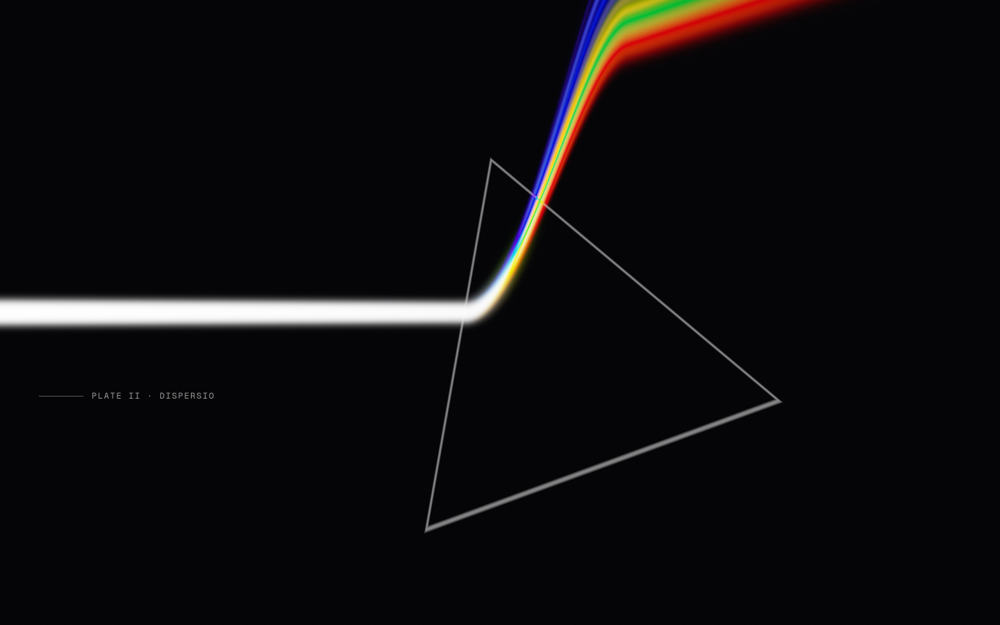</td>
<td width="33%"></td>
<td width="33%"></td>
</tr>
<tr>
<td><strong>Tier 1</strong> — full post chain</td>
<td><strong>Tier 2</strong> — bloom and dither</td>
<td><strong>Tier 3</strong> — dither only</td>
</tr>
</table>

Measured as the fraction of the frame above the void floor: **6.88%**, **6.89%**, **6.05%**.
Tiers 1 and 2 are within a rounding error of each other at this offset because §5.6 gives both
of them bloom, and the difference between them — DPR cap, spectral sample count, simulation
resolution — does not show on a plate this sparse. Tier 3 drops bloom and loses most of a
percent of the frame with it.

What tier 3 does **not** drop is the dither. §10 forbids removing it, and the reason is the
tier it survives on: the cheap panels that land in tier 3 are exactly the ones whose gradients
band without it.

Tier 4 is not shown because there is nothing to photograph. It is the no-WebGL2 path (§6.3) —
the document, the type, and no canvas at all.

---

## The states

Three things the piece does that are not on the scroll path.

<table>
<tr>
<td width="50%">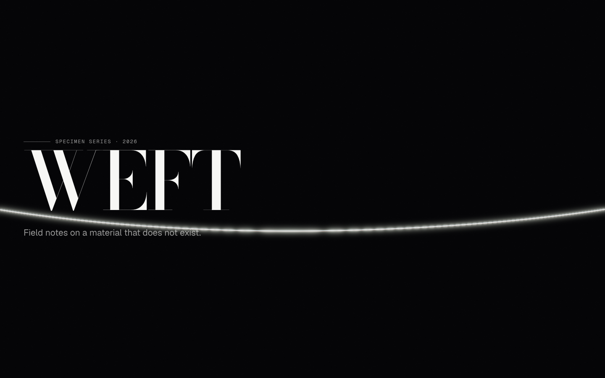</td>
<td width="50%">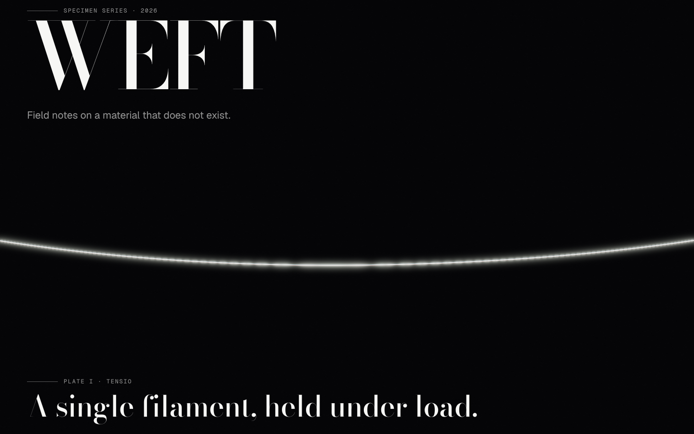</td>
</tr>
<tr>
<td><strong><code>prefers-reduced-motion</code></strong> — the plate is <em>stated</em>, not
animated. This was one of the red team's finds: the first version pinned the clock, which does
nothing to an integrator, and the wave kept propagating at a constant timestep. It now takes a
branch that writes the pose directly, so the frame is idempotent (RT-02).</td>
<td><strong>Specimen Mode</strong> (<code>S</code>) — every simulation held at a fixed pose, for
photographing the piece. Nothing steps once it has settled, so two captures a minute apart are
byte-identical.</td>
</tr>
</table>

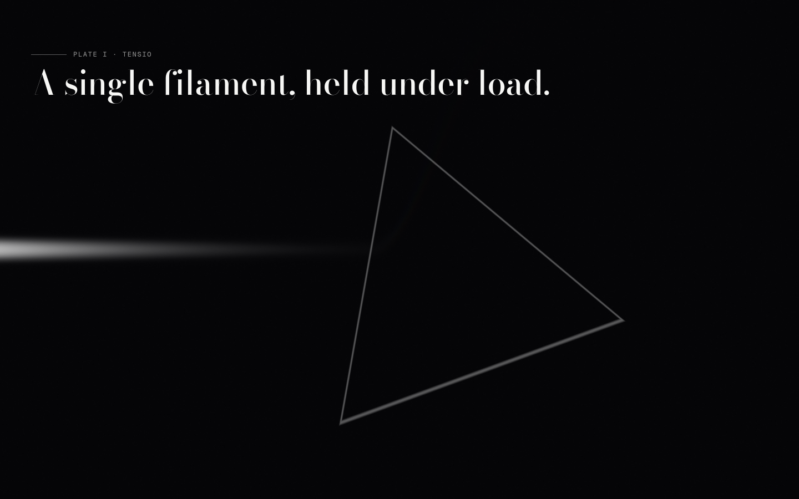

<em>The Plate I → II boundary. §1.2 asks that a plate change read as a transformation rather
than a cut, which means both plates are live in the same frame — the router allows at most two,
and the plate table's ranges are asserted to tile [0,1] with no gap and no overlap.</em>

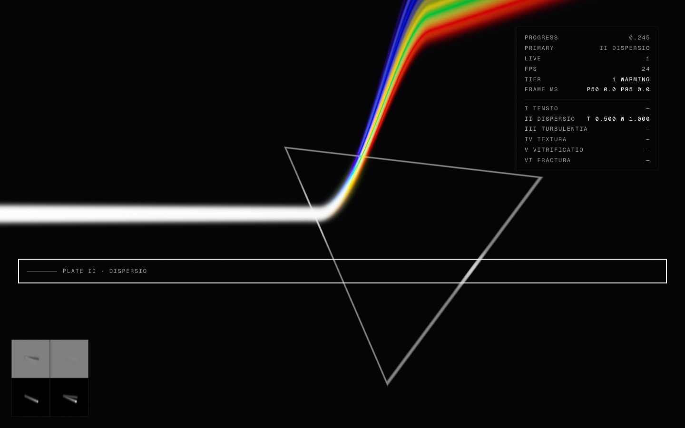

<em><code>D</code> toggles the L1 instrument. Every number in this README was read from it or
from the harness behind it — scroll progress, which plates are live and at what local time and
blend weight, the device tier and its switch count, and the shared touch field drawn in the
corner. It repaints on every sixth frame rather than every frame, so that the overlay cannot
itself be what shows up in the heap-growth gate.</em>

---

## Verification

Every claim above has an artifact behind it in [`docs/verification/`](docs/verification).

| What                                      | Result                                                                                                                                 |
| ----------------------------------------- | -------------------------------------------------------------------------------------------------------------------------------------- |
| Canvas clears to `--void`                 | delta **0** at DPR 2, proven against a magenta-backed control so the page background cannot pass the test for the canvas               |
| Lighthouse accessibility                  | **100** · best-practices 100 · SEO 100 · zero failed audits                                                                            |
| axe-core                                  | **0 violations**                                                                                                                       |
| Plate router, full 0→1 pass               | 201 samples, **0 dropped**, never more than 2 live, 6/6 plates visited                                                                 |
| Leaked GL objects during a scroll pass    | **0** textures, framebuffers, renderbuffers, buffers, programs                                                                         |
| Heap growth, 600 frames of real scrolling | **−44 KB** (−73.7 B/frame) — the heap _shrank_                                                                                         |
| Curl field, \|∇·v\| / ‖∇v‖_F              | **6.98 × 10⁻³** over 1024 scattered points                                                                                             |
| Bayer 8×8                                 | visits all **64/64** levels exactly once                                                                                               |
| GPU easing vs. CSS `cubic-bezier`         | max delta **1.4 × 10⁻⁷**                                                                                                               |
| Shader programs that fail to link         | **0**, swept across the whole document at tier 1 — a program that does not link is a console line and a missing pass, not an exception |
| Plate I bleeding into Plate III           | outer 4% of the frame within **4 levels** of `--void` — the dither, and nothing else. 245 with the defect reinstated                   |
| CPU spectral fit vs. the GLSL it copies   | **exact**, compared against the bytes of the shader rather than against a restatement of the constants                                 |

The shader chunk tests are the ones worth opening. Each chunk is checked against something
**independent of itself** — tabulated CIE data, an independent JS bezier solver, an analytic
identity, or a mathematical property that must hold. A shader test that asserts the shader
agrees with itself catches nothing. They run in Playwright against a real WebGL2 context and
read back **RGBA32F**, because asserting a colour-matching fit to ±0.02 through an 8-bit target
means asserting against a 0.0039 quantisation floor.

---

## Performance

| Metric                                         | Value                                             |
| ---------------------------------------------- | ------------------------------------------------- |
| Bundle, gzipped JS on the critical path        | **66.9 KB** (target < 400 KB)                     |
| Renderer chunk, loaded only when WebGL2 exists | 298 KB                                            |
| Self-hosted fonts, latin subset                | **96.5 KB** — three variable faces                |
| Shader source                                  | **609** substantive lines across 15 `.glsl` files |
| Tier-1 p95 at DPR 2                            | `[pending — no GPU in the build environment]`     |
| Mobile tier-3 sustained                        | `[pending]`                                       |

**The frame-time figures are bracketed on purpose.** This build ran in a container with no GPU;
every frame was rasterised by SwiftShader, where the composite pass's sRGB encode alone is three
`pow()` per pixel over 5.2M pixels — about 15M transcendentals per frame, microseconds on real
hardware and a quarter of a second in software. Presenting those numbers as the site's
performance would be a fabrication.

What _can_ be measured here is measured. The perf harness samples four series every run — an
idle page with no canvas, a bare `gl.clear()` loop at the same size and DPR, the site with its
DOM layer hidden, and the site as shipped — and reports the differences, with the renderer
string attached to the artifact so a software number can never be mistaken for a hardware one.
On a non-software renderer the harness automatically asserts the tier-1 contract of p95 < 16.6 ms.

Device tiering is hysteretic: 90 consecutive frames past a threshold before anything moves, and
the streak resets whenever the reading agrees with the current tier again. Tested against the
case it exists for — **6000 frames alternating either side of the 12 ms boundary produce zero
switches**.

---

## Accessibility

The DOM is the source of truth, and it is **prerendered at build time** — the shipped
`index.html` contains the full catalogue as real markup, so a crawler, a reader-mode
extractor, or anyone whose script fails on a bad connection gets the complete document. React
hydrates over it rather than replacing it.

One `h1`, an `h2` per plate, `aria-hidden` on the canvas. **Tab reaches every plate**, arrows
and PageUp/PageDown nudge scroll through the smoothed scroller, Home/End jump the document,
Esc releases focus, and a skip link precedes everything.

`prefers-reduced-motion` **stops the simulations**, verified by asserting two full-page
screenshots three seconds apart are byte-identical. The designed Specimen Mode — frozen at each
plate's most legible frame with the annotation layer on — is L4; what ships now honours the
preference rather than waiting for the prettier version. `S` and `D` toggle Specimen Mode and
the debug HUD.

Lighthouse: **accessibility 100 · best-practices 100 · SEO 100**, zero failed audits.
axe-core: zero violations.

**One place this build deviates from its own specification, deliberately.** The spec assigns
`--ink-35` to annotation text. Composited over the void that is **2.95:1**, which fails WCAG AA
at any size. The five token _values_ ship exactly as specified and are asserted verbatim; what
changed is the _assignment_ — annotation text is set in `--ink-60` (**6.88:1**), and `--ink-35`
is reserved for leader rules that carry no information their adjacent text does not. A test
fails the build if either of the two lowest inks is ever used as a `color:`.

---

## Build it

```bash
pnpm i
pnpm fonts:sync     # copy latin woff2 subsets into public/fonts
pnpm dev

pnpm verify         # tsc + eslint --max-warnings 0 + vitest + build
pnpm shaders        # GPU chunk tests against real WebGL2
pnpm a11y           # axe-core
pnpm gate:l1        # the L1 exit gate: dropped plates, FBO leaks, heap growth

pnpm capture --at 0.245 --debug    # a still at a scroll offset, HUD on
pnpm media && pnpm media:gifs      # the media in this README
```

`pnpm capture` waits for the smoothed scroll to settle and asserts the reached offset is within
0.01 of the requested one, so a filename cannot claim an offset the frame was not taken at.

---

## Stack

Vite 6 · React 19 · TypeScript 6 strict · three · @react-three/fiber · lenis · gsap · zustand ·
Vitest · Playwright

A [red-team pass](docs/verification/red-team.md) found and fixed twelve real defects — four of
which were fixes that looked correct in the diff and did nothing at runtime, caught only
because the tests measure outcomes rather than assert that code exists.

Decisions that were delegated rather than specified are recorded with their reasoning in
[`DECISIONS.md`](DECISIONS.md) — 20 entries, including the three places the specification
contradicted itself and how each was resolved. Reference gathering is in
[`RESEARCH.md`](RESEARCH.md), cited to primary sources with file and line numbers.

## Credits

Every borrowed technique and third-party asset is recorded in [`CREDITS.md`](CREDITS.md).
The one file shipped substantially verbatim — Ashima Arts' textureless simplex noise, MIT — says
so at the top and is left in upstream formatting so it can be diffed against the original.

Typefaces: **Bodoni Moda** (Owen Earl, indestructible type\*) and **Geist** / **Geist Mono**
(Vercel), all SIL Open Font License 1.1.

---

<sub>MIT licensed. Built by Christi Reid.</sub>
